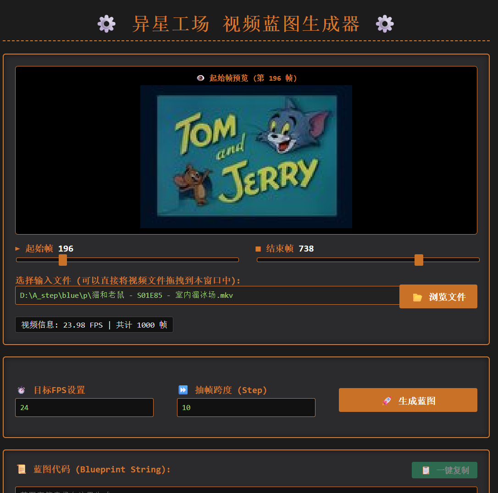
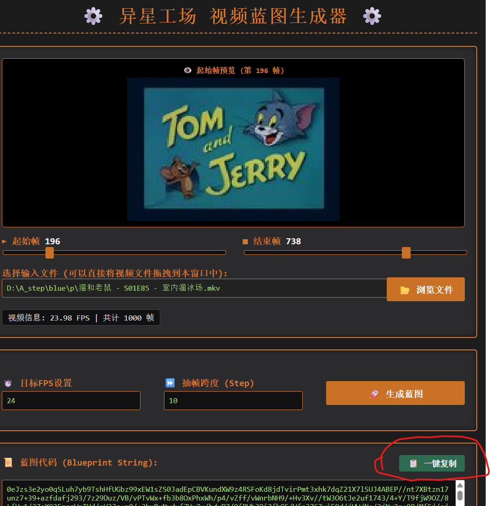
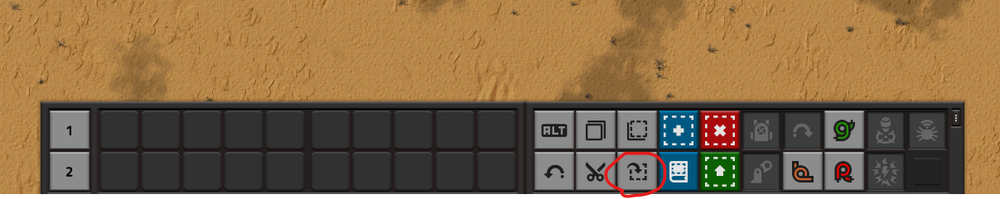
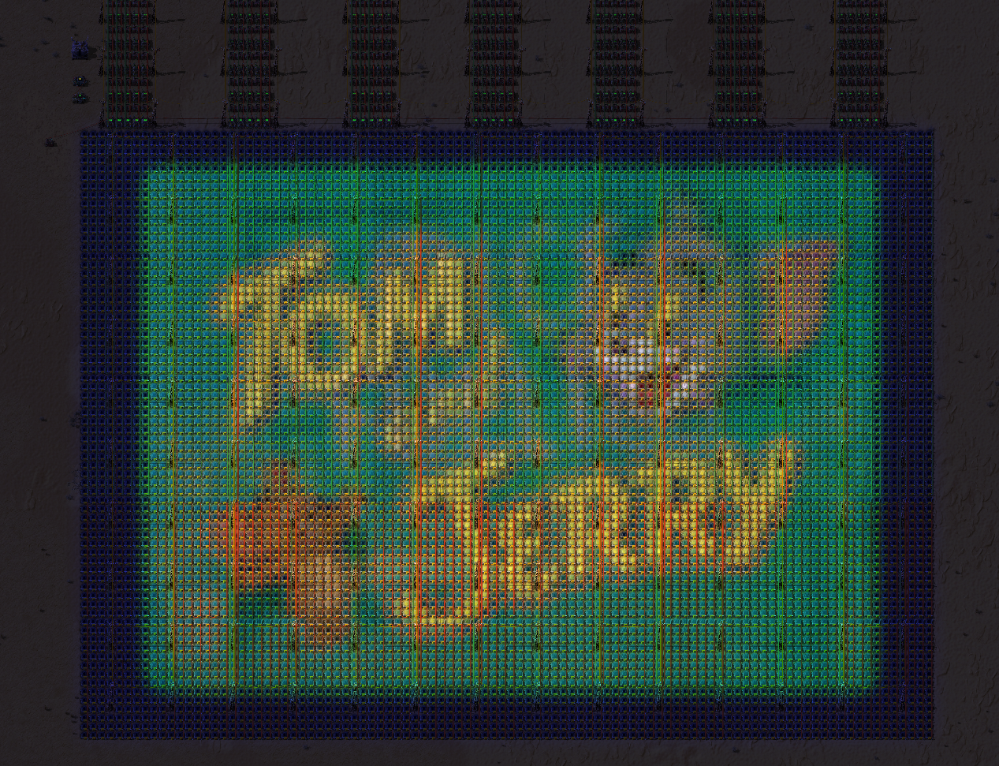

# ⚙️ Factorio Video Blueprint Generator (异星工场视频蓝图生成器)


**Factorio Video Blueprint Generator** 是一个硬核且有趣的项目。它可以将你电脑上的视频（或 GIF 动画）经过切片、压缩和颜色转换，最终自动生成为《异星工场 (Factorio)》的 **巨型屏幕蓝图代码**。通过这款工具，你可以直接在异星工场的游戏世界里，用无数的指示灯和算符组合，播放你喜欢的视频！

可以在 release页面下载exe
## 🌟 核心特性 (Features)

- 🎨 **工业风 GUI 界面**：采用完美适配《异星工场》风格的精美 UI 设计。
- ✂️ **可视化视频截取**：拖动滑块即可自定义起始帧与结束帧。
- ⏩ **抽帧自定义配置**：通过设置目标 FPS 与抽帧跨度（Step），完美控制蓝图体积上限。
- 📋 **一键复制蓝图**：生成完毕后，内置一键复制蓝图代码到剪贴板，立刻切换到游戏中粘贴！
- 🔧 **完美连线逻辑**：自动绕开电线杆并完美处理网络信号线的连接逻辑。

## 📸 界面预览 (Screenshots)

> 
> 
> 
> 
> 

## 🛠️ 安装要求 (Prerequisites)

为了运行本软件，你需要确保你的环境中安装了 Python 3.8+ 并安装以下依赖包：

```bash
pip install pywebview imageio[pyav] Pillow numpy
